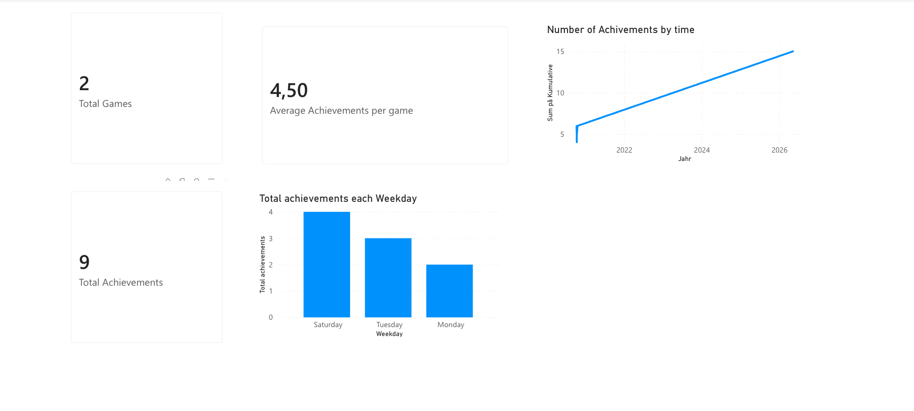

# Steam Achievement Monitor
 
A microservices system that monitors Steam users' achievements and sends webhook notifications when new achievements are unlocked.
 
> **Note:** Many technologies in this project were new to me, including Docker, PostgreSQL, and webhooks. I chose Python as the backend language since it allowed me to focus on learning these new concepts without also learning a new programming language at the same time.
 
---
 
## Architecture Overview
 
The system consists of three main components running as separate services:
 
```
Steam API
    ↓
Poller Service        ← fetches achievements every 15 minutes
    ↓
PostgreSQL DB         ← stores games and achievements
    ↓
Webhook Notification  ← sends Slack message on new unlock
```
 
**Database tables:**
- `games` – all games owned by the Steam user
- `achievements` – all achievements per game, with unlock status and timestamp
**Dashboard:** Power BI connects directly to PostgreSQL and visualizes the statistics.
 
---
 
## Technology Decisions
 
### Why Python instead of TypeScript
 
The case listed TypeScript as the preferred language. With more time, this would be the right choice – but this project introduced several technologies that were new to me simultaneously: Docker, PostgreSQL, and webhooks. Using a familiar language (Python) allowed me to focus on understanding these concepts rather than also learning a new language.
 
I would rather submit code I fully understand and can defend than code written in an unfamiliar language. The architecture is intentionally modular, so individual services could be rewritten in TypeScript without affecting the rest of the system.
 
### Why Power BI for the dashboard
 
Power BI connects natively to PostgreSQL and provides good visualizations with minimal code. I think the frontend part would be considerlly easier to do using Typecript or similar languages. 
 
---
 
## Project Structure
 
```
steam-achievements/
├── docker-compose.yml
├── .env.example
├── services/
│   └── poller/
│       ├── main.py          ← entry point, runs in Docker
│       ├── steam_api.py     ← Steam API wrapper
│       ├── database.py      ← PostgreSQL setup and models
│       ├── poller.py        ← achievement diff logic
│       └── webhooks.py      ← Slack webhook notifications
└── dashboard/
    └── steam_achievements.pbix
```
 
### File descriptions
 
**`main.py`**
Entry point for the Docker container. Starts a scheduler that polls Steam every 15 minutes and triggers webhook notifications when new achievements are detected. No logic is defined here – it imports from the other files and wires them together.
 
**`steam_api.py`**
Async wrapper around the Steam Web API (`https://api.steampowered.com`). Handles fetching owned games and achievements per game, with error handling for private profiles and games without achievements.
 
**`database.py`**
Sets up the async PostgreSQL connection using SQLAlchemy. Defines the `games` and `achievements` tables and creates them on startup if they don't exist.
 
**`poller.py`**
Implements the core polling logic. Fetches achievements from Steam, compares them against what is stored in the database, updates the database if there are differences, and calls the webhook for any newly unlocked achievements.
 
**`webhooks.py`**
Sends a formatted message to a Slack channel whenever a new achievement is unlocked.
 
---
 
## Setup Instructions
 
### Prerequisites
 
- Docker and Docker Compose installed
- A Steam API key – get one at [steamcommunity.com/dev/apikey](https://steamcommunity.com/dev/apikey)
- Your Steam ID (64-bit format)
- A Slack webhook URL (optional – for notifications)
**Note**
Stated in the .env file is my api key, stream id, and webhook to my personal channel on slack 

### 1. Clone the repository
 
```bash
git clone https://github.com/oscarholmen/Steam-achievements.git
cd Steam-achievements
```

 
### 2. Start the system
 
```bash
docker-compose up --build
```
 
This starts PostgreSQL and the poller service. The first poll runs immediately on startup.
 
---
 
## Docker Setup
 
| Service    | Description                        | Port  |
|------------|------------------------------------|-------|
| `postgres` | PostgreSQL database                | 5433  |
| `poller`   | Steam polling + webhook dispatcher | –     |
 
The poller waits for PostgreSQL to be healthy before starting, so no manual sequencing is needed.
 
---
 
## API Testing with Postman
 
Postman was used to explore the Steam API endpoints and identify which data was useful before implementing the integration.
 
**GetOwnedGames** – lists all games for a user:

 
**GetPlayerAchievements** – lists achievements for a specific game:

 
---
 
## Webhook Notifications
 
When a new achievement is unlocked, a message is automatically posted to a Slack channel via a configured incoming webhook.
 

 
---
 
## Dashboard
 
Statistics are visualized in Power BI, connected to the PostgreSQL database.
 
**Metrics displayed:**
- Total games with achievements
- Total achievements unlocked
- Average achievements per game
- Achievements by weekday
- Cumulative achievements over time

