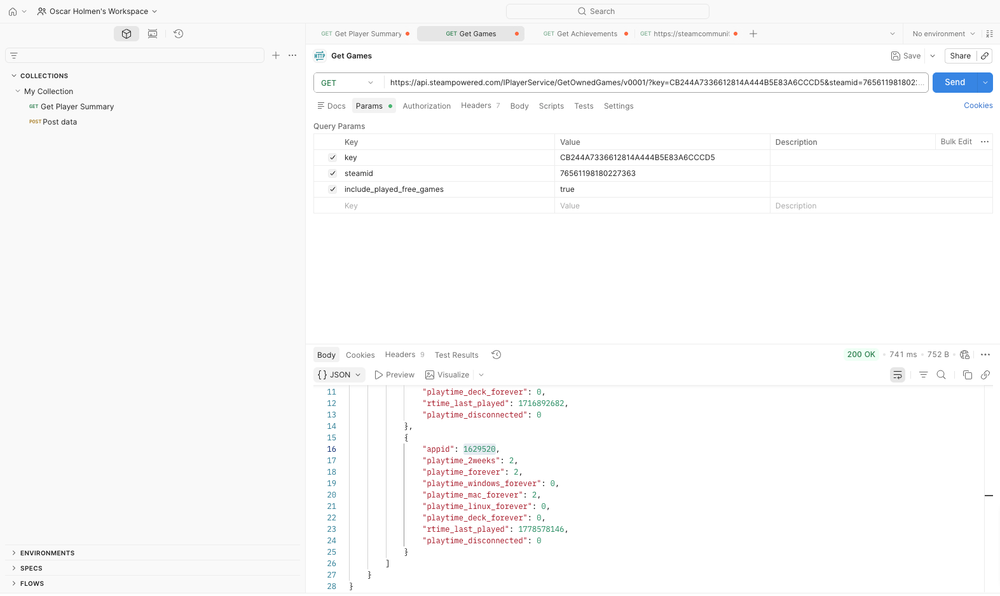
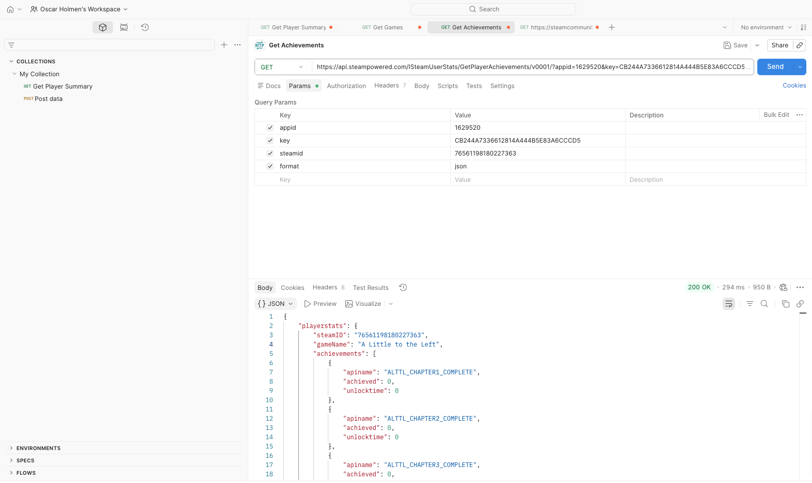

# Steam-achievements
The Repo is to solve a Case regarding fetching player achievements from Steam, and creating dashboards with different statistics regarding these achievements. Many things in this case is new to me, like Docker, Postgres, and webhooks. Therefore i have chosen to code in Python as this is the coding language i am most comfortable using. 

# Architecture Overview:
The task is to create a microservices system that monitors Steam users´achivements and send webhook notifications when new achievements are unlocked. The Webhook notification is sent to my workspace in Slack on the channel called testing-Webhook, as a message from Demo App.

As Database for the Achievements i am using Postgres, and there are stored two different tables of interest: "achievements" and "games".

The code is written in Python, and made up of 5 main files:
## - main.py
This is the main code that will be run on the docker container. This has scheduled fetching from the Steam API to the DB, and calls the webhook whenever a new achievement is recorded. 
No functions are defined in this file, but rather imported from the other files.

## - steam_api.py
This python-file has the code used to access the Steam API. This collects the data using the API https://api.steampowered.com. This has just functions, and the specific polling is implemented in poller.py

## - database.py
This python-file sets up the Postegres database, with the two usefull tables "achievements" and "games"

## - poller.py
Here the polling of achivements from Steam API is implemented at schedule of 15 minute intervalls. If the data polled from Steam are different then the one stored in the DB, the DB is updated, and the webhook is called to notify the user.   

## - webhooks.py
This file has the code used to generate notifications to the slack channel. 

# Setup code for testing

# Docker Setup

# Postman
To experiment with the Steam API and to find out where i can find the usefull data, Postman was used to inspect the promising API-endpoints. 

